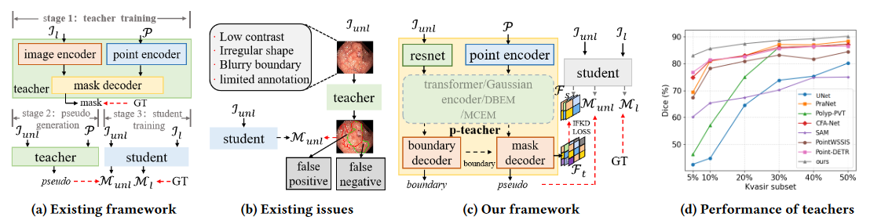
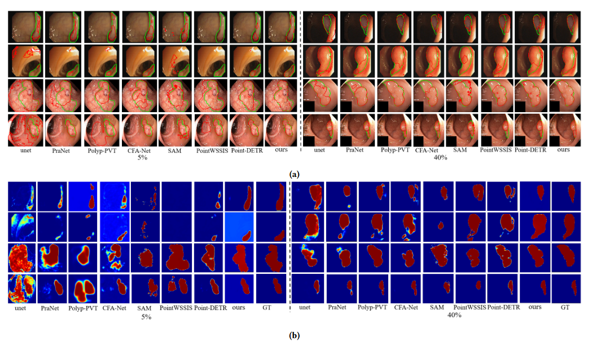
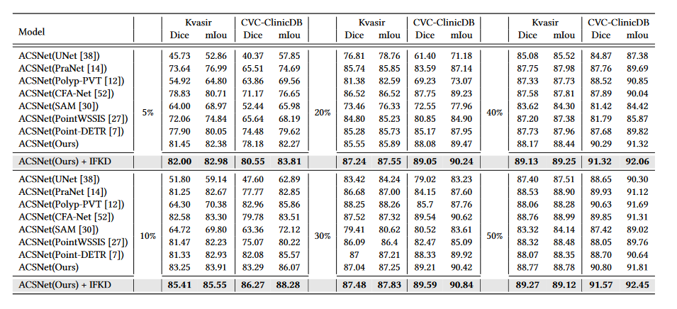
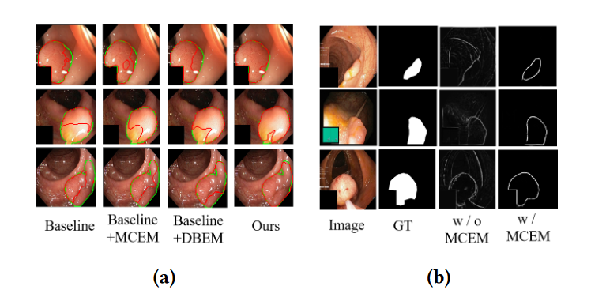

#  WS-Polyp: Improved Weak Semi-supervised with point teacher for polyp segmentation


##  Requirements

* torch
* torchvision 
* tqdm
* opencv
* scipy
* skimage
* PIL
* numpy

### 1. Recent Methods
<p align="center">
     <br />
    <em> 
    Figure 1: From (a) to (d), they are segmentation methods based on polyp region, segmentation methods introducing boundary information, polyp context extraction method, our method, respectively.
    </em>
</p>

### 2. Framework Overview

<p align="center">
     <br />
    <em> 
    Figure 2: The overall framework of our method.
    </em>
</p>
<p align="center">
     <br />
    <em> 
    Figure 3: (a) Global Context Extraction Module (GCEM). (b) Boundary Extraction
Module (BEM).
    </em>
</p>
<p align="center">
     <br />
    <em> 
    Figure 4: Uncertainty Residual Attention Moudule (URAM).
    </em>
</p>

### 3. Training

```bash
python train.py  --mode train  --dataset kvasir_SEG  
--train_data_dir /path  --valid_data_dir  /path
```

###  4. Inference

```bash
python test.py  --mode test  --load_ckpt checkpoint 
--dataset kvasir_SEG    --test_data_dir  /path
```
###  5. result
<p align="center">
     <br />
    <em> 
    Figure 5: Visual comparison of polyp segmentation results.
    </em>
</p>
<p align="center">
     <br />
    <em> 
    Figure 6: vison of edge segmentation.
    </em>
</p>
<p align="center">
     <br />
    <em> 
    Figure 7: Precision-Recall and F-measure curves of our model and other eight state-of-the-art methods on two datasets including Kvasir and CVC-ClinicDB.
    </em>
</p>
<p align="center">
     <br />
    <em> 
    Figure 8: Quantitative results of the Kvasir-SEG and CVC-ClinicDB test datasets. The best results are shown in \textbf{bold} fonts.
    </em>
</p>
<p align="center">
     <br />
    <em> 
    Figure 9: (a) Visual comparison of module. (b) Scale-based evaluation different sizes of polyps.
    </em>
</p>
<p align="center">
     <br />
    <em> 
    Figure 10: Ablation experiments on the remaining four datasets including CVC-300, CVC-ColonDB, CVC-ClinicDB and ETIS.
    </em>
</p>
